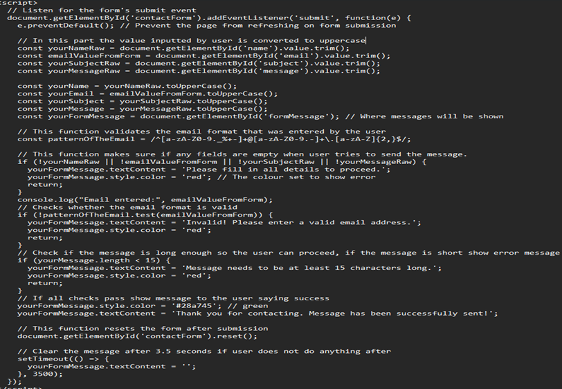
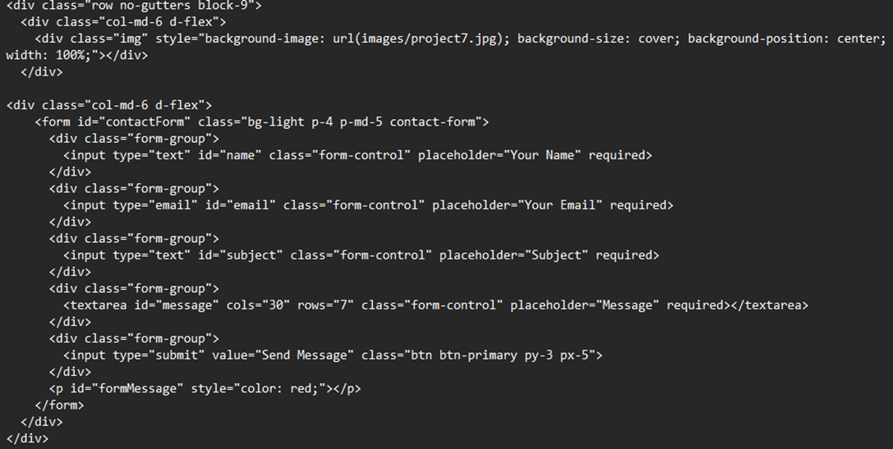
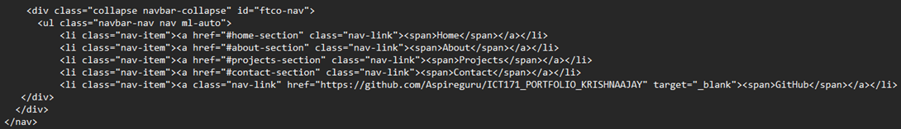
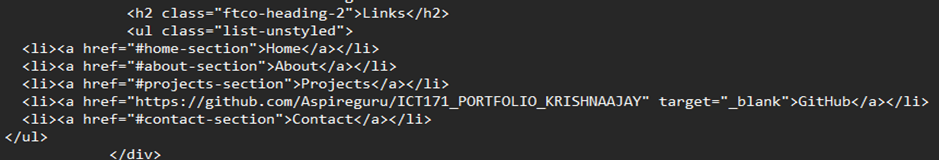

# DEPLOY THE FREE TEMPLATE (RONALDO BOOTSTRAP 4 PORTFOLIO TEMPLATE)
Editing the template to match my portfolio information, adding manual JavaScript and CSS scripts and removing sections that are not needed. The JavaScripts were used to show real-time to the users as they are in my portfolio website.

- Download the Bootstrap 4 portfolio template from https://themewagon.com/themes/free-bootstrap-4-html5-one-page-personal-portfolio-website-template-ronaldo/
- Extract the zip file using 7-Zip
- Open the index.html

------------------------------------------------------------------------------------------------------------------------------------------------------------------------------------------------------------------------------
## EDIT THE CUSTOM TEMPLATE TO MATCH MY CONTENT
We can edit this section by typing <span class= “subheading”>
First edit to add my name and a  small animation with rotation


Next section
### We can edit this section by typing <p class= “about=text”>
This section is an about me page where a brief about me and d strengths


### We can edit this section by typing <uI Class=” about-info mt-4 px-md-0 px-2”>
This section is basic personal contact details


### Editing the top page menu
We can edit this section by typing <nav id="navi">


------------------------------------------------------------------------------------------------------------------------------------------------------------------------------------------------------------------------------
## UPDATING EDUCATION SECTION
We can edit this section by typing <div class="text pl-3">


------------------------------------------------------------------------------------------------------------------------------------------------------------------------------------------------------------------------------
## UPDATING EXPERIENCES SECTION
### We can edit this section by typing <div id="page-2" class= "page two">


------------------------------------------------------------------------------------------------------------------------------------------------------------------------------------------------------------------------------
## UPDATING THE SKILLS SECTION
### We can edit this section by typing <div id="page-3" class= "page three">


------------------------------------------------------------------------------------------------------------------------------------------------------------------------------------------------------------------------------
## NOW UPDATE HORIZONTAK SKILLS
### We can edit this section by typing  <div class="col-md-6 animate-box">


------------------------------------------------------------------------------------------------------------------------------------------------------------------------------------------------------------------------------
## REMOVE THE AWARDS SECTION WITH THE CERTIFICATE SECTION
### We can edit this section by typing <div id="page-4" class="page four">
Manual HTML scripting


------------------------------------------------------------------------------------------------------------------------------------------------------------------------------------------------------------------------------
## UPDATE EACH PROJECT ACCORDINGLY (MANUAL HTML SCRIPTING)
### Removed all the default projects and replaced them with mine


- Added all the certifications according to the certificates.
- Next, I removed the service section, blog section since this is my first portfolio

### We can edit this section by typing <section class="ftco-section ftco-hireme img"


## Next section similar but with more details, such as address, phone number and website.
### We can edit this section by typing <div class="row d-flex contact-info mb-5">


------------------------------------------------------------------------------------------------------------------------------------------------------------------------------------------------------------------------------
## UPDATING HEADER AT THE END
### We can edit this section by typing <ul class="list-unstyled">

- Replace services at the end of the page with relevant skills

### We can edit this section by typing <div class="block-23 mb-3">


### Replaced the licensing of the page and used my licensing, but credited colorlib for using their template


------------------------------------------------------------------------------------------------------------------------------------------------------------------------------------------------------------------------------
## FIXING INCONSISTENT FONTS IN EDUCATION SECTION
### Manual CSS script 
Open the CCS folder in the root folder, then open style.css and scroll to the very bottom.
h2 {
font-weight: 700 !important;

------------------------------------------------------------------------------------------------------------------------------------------------------------------------------------------------------------------------------
## LIVE TIME DISPLAY CLOCK (JavaScript)
### Description 
A custom live digital clock was displayed on the site. This clock uses JavaScript, and the clock updates every second using the function setInterval() and formats time using its built-in Date object.

#### In index.html add
- <div id="clock">00:00:00</div> 
- Add it just below <body data-spy="scroll" data-target=".site-navbar-target" data-offset="300">. You can edit this section by typing that script as well.

#### Then in the <script> section at the bottom of the page (above </body>), add:
For easy access you can type </body> using ctrl+f function

```html
<script>
  function ShowsTheCurrentTime() {
    const TimeCurrent = new Date();
    const TimeFormatted = TimeCurrent.toLocaleTimeString();
    document.getElementById('clock').textContent = TimeFormatted;
  }

  setInterval(ShowsTheCurrentTime, 1000);
  ShowsTheCurrentTime(); // Run at start
</script>
```

#### We also need to update the style.css to do that. Open the ccs folder in the root folder, then open style.css and scroll to the very bottom. Paste this code to position and style the clock
}
#clock {
  position: fixed;
  top: 10px;
  left: 10px;
  background-color: transparent;
  color: black;
  font-size: 16px;
  font-family: 'Poppins', sans-serif;
  z-index: 9999;
}

------------------------------------------------------------------------------------------------------------------------------------------------------------------------------------------------------------------------------
## FORM VALIDATION FOR USER FORM (JavaScript)
The user form in the template did not have user validation. Once the user enters details and submits, it is not acknowledged by the site; it just refreshes the page. It is also used to accept user information even if any part of the form is blank. The JavaScript I created below will validate required fields such as name, message, and email. It also ensures the email address follows the correct format using RegEx.  Overall, it will improve the user experience on my site and prevent empty and invalid submissions.

```html
<script>
  // LISTEN FOR THE FORM'S SUBMIT EVENT
  document.getElementById('contactForm').addEventListener('submit', function(e) {
    e.preventDefault(); // Prevent the page from refreshing on form submission

    // IN THIS PART THE VALUE INPUTTED BY USER IS CONVERTED TO UPPERCASE
    const yourNameRaw = document.getElementById('name').value.trim();
    const emailValueFromForm = document.getElementById('email').value.trim(); 
    const yourSubjectRaw = document.getElementById('subject').value.trim();
    const yourMessageRaw = document.getElementById('message').value.trim();

    const yourName = yourNameRaw.toUpperCase();
    const yourEmail = emailValueFromForm.toUpperCase(); 
    const yourSubject = yourSubjectRaw.toUpperCase();
    const yourMessage = yourMessageRaw.toUpperCase();
    const yourFormMessage = document.getElementById('formMessage'); // Where messages will be shown

    // THIS FUNCTION VALIDATES THE EMAIL FORMAT THAT WAS ENTERED BY THE USER
    const patternOfTheEmail = /^[a-zA-Z0-9._%+-]+@[a-zA-Z0-9.-]+\.[a-zA-Z]{2,}$/;

    // THIS FUNCTION MAKES SURE IF ANY FIELDS ARE EMPTY WHEN USER TRIES TO SEND THE MESSAGE.
    if (!yourNameRaw || !emailValueFromForm || !yourSubjectRaw || !yourMessageRaw) {
      yourFormMessage.textContent = 'Please fill in all details to proceed.';
      yourFormMessage.style.color = 'red'; // The colour set to show error
      return;
    }

    console.log("Email entered:", emailValueFromForm);

    // Checks whether the email format is valid 
    if (!patternOfTheEmail.test(emailValueFromForm)) { 
      yourFormMessage.textContent = 'Invalid! Please enter a valid email address.';
      yourFormMessage.style.color = 'red';
      return;
    }

    // CHECK IF THE MESSAGE IS LONG ENOUGH SO THE USER CAN PROCEED
    if (yourMessage.length < 15) {
      yourFormMessage.textContent = 'Message needs to be at least 15 characters long.';
      yourFormMessage.style.color = 'red';
      return;
    }

    // IF ALL CHECKS PASS SHOW MESSAGE TO THE USER SAYING SUCCESS
    yourFormMessage.style.color = '#28a745'; // green
    yourFormMessage.textContent = 'Thank you for contacting. Message has been successfully sent!';

    // THIS FUNCTION RESETS THE FORM AFTER SUBMISSION
    document.getElementById('contactForm').reset();

    // CLEAR THE MESSAGE AFTER 3.5 SECONDS
    setTimeout(() => {
      yourFormMessage.textContent = '';
    }, 3500);
  });
</script>
```
### script is added this <script> block just before the closing </body> tag in your index.html file


- Next, open index.html. Add an ID to each of the input fields
- Also, add a message display element This needs to be after the submit button



------------------------------------------------------------------------------------------------------------------------------------------------------------------------------------------------------------------------------
## UPLOADING CV FILE SO USERS CAN DOWNLOAD IT FROM MY WEBSITE (HTML)
- Adding a download file in the HTML file and placing it just above </section>
### Added the following line
<a href="CV/krishna-cv.pdf" download class="btn btn-primary py-3 px-5">Download CV</a>
The actual CV should be placed in CV/krishna-cv.pdf. If no folder exists, create a new folder called CV.

------------------------------------------------------------------------------------------------------------------------------------------------------------------------------------------------------------------------------
## ADDED GITHUB BASIC INTEGRATION
<li><ahref="https://github.com/Aspireguru/ICT171_PORTFOLIO_KRISHNAAJAY"target="_blank">GitHub</a></li>

------------------------------------------------------------------------------------------------------------------------------------------------------------------------------------------------------------------------------
## ADDED FUNCTION TO GO BACK TO THE CORRECT SECTION WHEN CLICKING ON MENU IN NAVIGATION BAR



## ADDED FUNCTION TO GO BACK TO THE CORRECT SECTION WHEN CLICKING ON MENU IN LINKS AT THE END OF THE PAGE



