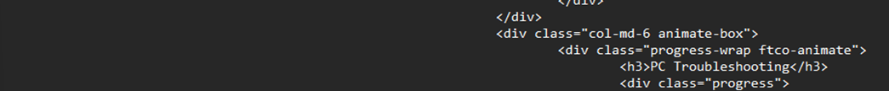

# DEPLOY THE FREE TEMPLATE (RONALDO BOOTSTRAP 4 PORTFOLIO TEMPLATE)
Editing the template to match my portfolio information, add manual JavaScript and CSS scripts and remove sections that is not needed. The java scripts were used to show real time to the users as they are in my portfolio website.

- Download the Bootstrap 4 portfolio template from https://themewagon.com/themes/free-bootstrap-4-html5-one-page-personal-portfolio-website-template-ronaldo/
- Exact the zip file using 7zip
- Open the index.html

## EDIT THE CUSTOM TEMPLET TO MATCH MY CONTENT
We can edit this section by typing 
First edit to add my name and small animation with rotation

Next section
### We can edit this section by typing 

This section is an about me page where brief about me and strengths

### We can edit this section by typing <uI Class=” about-info mt-4 px-md-0 px-2”>
This section is basic personal contact details

### Editing the top page menu
We can edit this section by typing <nav id="navi">

## UPDATING EDUCATION SECTION
We can edit this section by typing 

## UPDATING EXPERIENCES SECTION
### We can edit this section by typing 

## UPDATING THE SKILLS ECTION
### We can edit this section by typing 

## NOW UPDATE HORIZONTAK SKILLS
### We can edit this section by typing  

## REMOVE THE AWARDS SECTION WITH CERTIFICATE SECTION
### We can edit this section by typing 

Manual html scripting

## UPDATE EACH PROJECT ACCORDINGLY (MANUAL HTML SCRIPTING)
### Removed all the default projects and replaced it with mine

- Added all the certification according to certificates.
- Next, I removed the service section, blog section since this is my first portfolio

### We can edit this section by typing <section class="ftco-section ftco-hireme img"

## Next section similar but more details, such as address, phone number and website.
### We can edit this section by typing 

## UPDATING HEADER AT THE END
### We can edit this section by typing <ul class="list-unstyled">

- Replace services at end of the page with relevant skills

### We can edit this section by typing 

### Replaced the licensing of the page and used my licensing but credited colorlib for using their template

## FIXING INCONSISTENT FONTS IN EDUCATION SECTION
### Manual CSS script 
Open ccs folder in the root folder then open style.css and scroll to the very bottom.
h2 {
font-weight: 700 !important;

## LIVE TIME DISPLAY CLOCK (JAVA SCRIPT)
### Description 
A custom live digital clock was displayed on the site. This clock uses java scripting, and the clock updates every second using the function setInterval() and formats time using its built-in date object.

#### In index.html add
- 
00:00:00
 
- Add it just below <body data-spy="scroll" data-target=".site-navbar-target" data-offset="300"> you can can edit this section by typing that scrip as well.

#### Then in the 

#### We also need to updater the style.css to do that open ccs folder in the root folder then open style.css and scroll to the very bottom. Paste this code to position and style the clock
}
#clock {
  position: fixed;
  top: 10px;
  left: 10px;
  background-color: transparent;
  color: black;
  font-size: 16px;
  font-family: 'Poppins', sans-serif;
  z-index: 9999;
}
