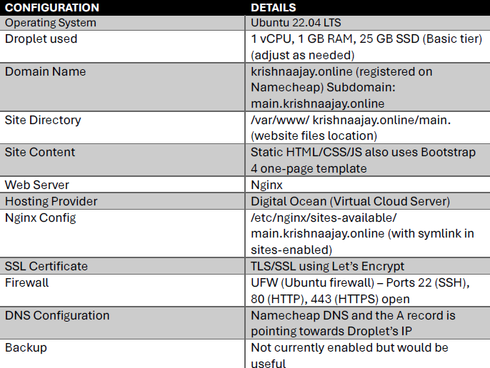
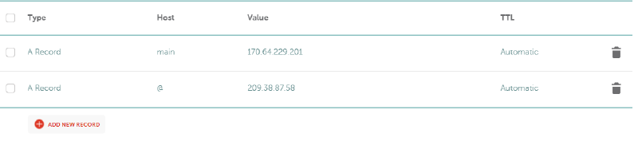

# 🌐🛠️ **PORTFOLIO WEBSITE SERVER BUILD AND TROUBLESHOOTING GUIDE**

## :blue_book: **PURPOSE OF DOCUMENT:**

This document provides a step-by-step guide to rebuilding my personal portfolio website and troubleshooting common issues. The website is a one-page static portfolio using the free Bootstrap 4 template. The page also has some custom student information, manual JavaScript and CSS scripts. The JavaScripts were used to show real-time data to the users as they are in my portfolio website. The server runs on Ubuntu 22.04 LTS Droplet using Digital Ocean with Nginx and Let’s Encrypt SSL. This document will help any IT professional recreate or restore my site in approximately 2 hrs.  It will include instruction on deploying my site, configuring the domain and SSL, and best practices using backup tips to resolve any issues that might come up.

## 📋 PERSONAL SITE CONFIGURATION TABLE

## :hammer_and_wrench: STEP-BY-STEP SERVER BUILDING INSTRUCTIONS

### :desktop_computer::droplet: STEP 1: SIGNING UP AND CREATING A DROPLET IN DIGITAL OCEAN

1. Sign up for Digital Ocean and click on the control panel, and click on create droplet
2. Choose Ubuntu 22.04 (LTS) x64 as the droplet (operating system).
3. Select the correct droplet: Basic droplet with 1 GB RAM, 1 CPU, 25 GB SSD (enough for my site)
4. Pick a data centre region (Sydney)
5. For authentication, I used a root password for easy access.
6. Give the droplet a name (ICT 171)
7. Click Create Droplet, public IP address of the new Droplet (170.64.229.201)

### :closed_lock_with_key::computer: STEP 2: CONNECTING TO THE SERVER FOR EASY ACCESS

Open CMD or any terminal on your local machine and connect to the Droplet using its IP address 170.64.229.201

#### Linux command
ssh root@170.64.229.201 (log in using SSH key or root password)

(In case of an issue, recheck that the Droplet was created with the correct SSH key or password, and that the IP is correct.)
------------------------------------------------------------------------------------------------------------------------------------------------------------------------------------------------------------------------------

### ⚙️🔄 STEP 3: INSTALL REQUIRED PACKAGES AND UPDATE
This ensures the system is up to date. The -y flag automatically accepts prompts for installing updates. This might take some time if packages need to be updated (important for security and stability)

#### Linux command
apt update && apt upgrade -y
------------------------------------------------------------------------------------------------------------------------------------------------------------------------------------------------------------------------------

### ⚙️🌐 STEP 4: INSTALL NGINX WEB SERVER
The next step is to install the Nginx web server that will serve my portfolio website. Ubuntu already has a repository that includes Nginx. On the server, install Nginx using apt.

#### Linux command
sudo apt update
sudo apt install nginx -y
After running the command, it will download Nginx and any required dependencies.
Nginx is started automatically. You can verify that Nginx is running by checking its status

#### Linux command to check status
systemctl status nginx
Here it would show Active: active (running). You can also test that Nginx is serving the default page by visiting the droplet’s IP (170.64.229.201) in a browser. You should see Nginx’s default “Welcome to Nginx” page, indicating the server is working.

------------------------------------------------------------------------------------------------------------------------------------------------------------------------------------------------------------------------------
### 📂🧱 STEP 5: SETTING UP THE PROJECT DIRECTORY
Set up a directory to hold the portfolio website’s files. By default, the web content on Ubuntu is served from /var/www. We now create a dedicated directory for the new subdomain main.krishnaajay.online under /var/www.

#### Linux command
1. sudo mkdir -p /var/www/krishnaajay.online/main
2. sudo chown -R $USER:$USER /var/www/krishnaajay.online/main

Directory for this site. We use the -p flag to ensure parent directories exist (though /var/www already exists, this flag just avoids errors if it didn’t).

------------------------------------------------------------------------------------------------------------------------------------------------------------------------------------------------------------------------------
### 💻📝 STEP 6: EDITING THE PORTFOLIO TEMPLATE ACCORDING TO MY PORTFOLIO
Please scroll to the student contribution to see it.

------------------------------------------------------------------------------------------------------------------------------------------------------------------------------------------------------------------------------
### 🔐📤 STEP 7: UPLOAD FILES TO NGINX SECURE SERVER USING SCP/SFTP AFTER EDITING TEMPLATES LOCALLY
1. Open CMD with admin privileges and upload the edited template to the directory we previously created.
2. Command to use: scp -r "C:\Users\MK535\OneDrive\Desktop\UNI 2025\ICT 171\Assignment 2 Cloud Project & Video Explainer\ronaldo-master\*" root@170.64.229.201:/var/www/krishnaajay.online/main/
This command will copy all files to the /var/www/ main.krishnaajay.online directory on the server.

------------------------------------------------------------------------------------------------------------------------------------------------------------------------------------------------------------------------------
### 🛠️📄 STEP 8: CONFIGURE NGINX SERVER BLOCK FOR THE PORTFOLIO SUBDOMAIN
Nginx uses server blocks to find what content to show for a given domain or subdomain. We will create a new server block configuration for main.krishnaajay.online. By doing so, Nginx knows to use our project directory and respond to requests. Generally, Nginx on Ubuntu stores server block configurations in /etc/nginx/sites-available/. There should be a default config file present. We will make a new config file.

#### Linus' command to create a  new config file
sudo nano /etc/nginx/sites-available/main.krishnaajay.online
Replace the default content with
server {
listen 80;
listen [::]:80;
server_name main.krishnaajay.online 170.64.229.201;
root /var/www/krishnaajay.online/main;
index index.html index.htm;
location / {
try_files $uri $uri/ =404;
}
}
Save and exit the editor (in nano, press Ctrl+X, then Y and Enter to confirm).

#### 📝 DETAILED BREAKDOWN OF EACH LINE:
- listen 80; and listen [::]:80; // tells nginx server to listen to ipv4 and 1pv6 port 80 (HTTP)
- Root /var/www/ main.krishnaajay.online;// specifies web root directory, this is where nginx will look for files.
- Index index.html index.htm;// sets the index files
- Server name main. krishnaajay.online;// defines the domain name that this server block will respond to. This needs to match the subdomain we use. www.main.krishnaajay.online is not needed, as we are using a subdomain of an existing domain
- location / { try_files $uri $uri/ =404;}// Since my website is operated as a static site directive is a common configuration. This tells Nginx to serve the file requested by the user, in case it is not found, try to serve a directory, and if nothing matches, return a 404 Not Found. This prevents Nginx from passing requests to the next server block or serving a default file.

------------------------------------------------------------------------------------------------------------------------------------------------------------------------------------------------------------------------------
### 🔗📁 STEP 9: ENABLE THIS CONFIGURATION BY CREATING A SYMLINK TO IT IN THE SITES-ENABLED DIRECTORY
This command enables server block. Nginx reads config from sites-enabled/ on startup using a symlink, so the actual files in sites-available/are easily manageable.

#### Linus command
sudo ln -s /etc/nginx/sites-available/main.krishnaajay.online /etc/nginx/sites-enabled/
sudo nginx -t
sudo systemctl restart nginx

------------------------------------------------------------------------------------------------------------------------------------------------------------------------------------------------------------------------------
### 🧪⚙️ STEP 10: CHECK NGINX CONFIGURATION FOR SYNTAX ERRORS
The output should say “syntax is ok” and “test is successful” if Nginx parse all config files and reports success or any errors.

#### Linux command
sudo nginx -t
The output should say “syntax is ok” and “test is successful” if Nginx parse all config files and reports success or any errors.

#### 🔍🛠️ TROUBLESHOOTING IF YOU RECEIVE ERRORS
- server_names_hash_bucket_size- means the domain name is long, and the default hash bucket size for server names is not enough. 
- This error suggests increasing server_names_hash_bucket_size.
How to fix it
Open/etc/nginx/nginx.conf, look for line # server_names_hash_bucket_size 64;. Remove the # to set the bucket size to 64. Save the file and run nginx -t again.

------------------------------------------------------------------------------------------------------------------------------------------------------------------------------------------------------------------------------
### ⚙️🔄 STEP 11: APPLY THE CHANGES BY RELOADING OR RESTARTING NGINX
Apply the new config without dropping connections.

#### Linus command
sudo systemctl restart nginx

Nginx is configured to serve the portfolio site now. We could do a check up by visiting http:// main.krishnaajay.online in a web browser. This might show up as “Site not found” since we have not set up DNS. Otherwise, we will properly test after DNS and SSL are set up.

------------------------------------------------------------------------------------------------------------------------------------------------------------------------------------------------------------------------------
### 🛡️🔐 STEP 12: SET PROPER FILE PERMISSIONS ON YOUR DIRECTORY
We want Nginx (which runs as the www-data user by default) to be able to read the files and optionally allow our user to edit them.

#### Linux command
sudo chown -R www-data:www-data /var/www/krishnaajay.online/main
sudo chmod -R 755 /var/www/krishnaajay.online/main

This sets the owner to your user and group www-data and makes all files/directories readable by others. The 755 permission ensures that directories are traversable and files are readable by everyone (the owner can also write).

------------------------------------------------------------------------------------------------------------------------------------------------------------------------------------------------------------------------------
### 📁🛠️ STEP 13: FIX NESTED FOLDER ISSUES IN DEPLOYMENT
Run these Linux commands to get the folder back into the right folder 

#### Linux command
sudo mv /var/www/krishnaajay.online/main/ronaldo-master/* /var/www/krishnaajay.online/main/
sudo rm -r /var/www/krishnaajay.online/main/ronaldo-master

------------------------------------------------------------------------------------------------------------------------------------------------------------------------------------------------------------------------------
### 🌐🔁 STEP 14: CONFIGURE NAMECHEAP DNS TO POINT YOUR SUBDOMAIN TO YOUR DOMAIN
This is important for Let's Encrypt and users to reach my site via the domain name, you need to create a DNS A record for the subdomain portfolio under your existing domain krishnaajay.online. My main domain is currently registered with Namecheap and used for Assessment 1.

#### 🔢📝 STEP-BY-STEP INSTRUCTIONS
1. Log in to my Namecheap account and go to the domain List or the manage domain section for krishnaajay.online.
2. Next, navigate to advanced DNS for the domain. This is where you manage your DNS records.
3. In the host record, click Add New Record
4. Choose A record as the type
5. In the host section, type portfolio Namecheap will append my main domain automatically.
6. In the IP address section, type in the droplet IP address
7. TTL can be left as automatic
8. Click on the tick icon to save it.
9. The record would look like this

Type: A Record
Host: portfolio
Value: 170.64.229.201 (my droplet’s IP)
TTL: Automatic

We need to allow time for DNS propagation as DNS changes are not instant, typically take about 30 minutes to take effect (though it can be faster or up to a couple of hours). We can use tools such as https://www.whatsmydns.net/. Once the propagation is done, we can visit main.main.krishnaajay.online in a browser.

------------------------------------------------------------------------------------------------------------------------------------------------------------------------------------------------------------------------------
### 🌐✅ STEP 15: VERIFY THAT DNS IS POINTING CORRECTLY
1. On the local machine, open CMD
2. Run: nslookup main.krishnaajay.online
3. Should see something like Address: 170.64.229.201

------------------------------------------------------------------------------------------------------------------------------------------------------------------------------------------------------------------------------
### 🔐⚙️ STEP 16: SECURE YOUR SITE WITH LET’S ENCRYPT SSL USING CERTBOT
Next step is to get a free SSL/TLS certificate and the Certbot tool to automate the installation I will be using lets encrypt since its free and has auto renewal.

- main.krishnaajay.online is already pointed to this server’s IP (it’s important to have it in place before obtaining the certificate)
- Port 80 (HTTP) is open and accessible from the internet (which we allowed in the firewall). Let’s Encrypt will use HTTP challenges to verify the domain.

Since I'm using Ubuntu 22.04, the best way to install Certbot is via snap. Install Certbot and its Nginx plugin.

#### Linus command
1. sudo apt install certbot python3-certbot-nginx -y
2. sudo certbot --nginx -d main.krishnaajay.online

#### 🧾 DETAILED EXPLANATION
--nginx-- tells Certbot to automatically configure Nginx for SSL. It will then edit the Nginx config or create a new one for HTTPS.
-d- specifies the domain name we want a certificate for. We can add an additional -d flag if we have many subdomains.

#### Upon running the command, certbot will prompt you:

1. An email for urgent renewal and registration with encrypt

2. Agree to Let’s Encrypt terms of service.

3. share your email with the EFF(optional)

4. Lastly, it will ask if you want to redirect HTTP to HTTPS. We will choose yes to automatically use the secure URL. If we select this option, the Nginx config will forward all port 80 requests to port 443.

5. Certbot will now perform domain validation. It creates a temporary challenge file under /.well-known/acme-challenge/ in the web root, and let's Encrypt can verify it using HTTP.

6. Next, you should be able to see a message like: “Successfully received certificate.” It will also show the locations where the certificate and key are saved (under /etc/letsencrypt/live/portfolio.krishnaajay.online/).

The site is now set to use HTTPS. All HTTP requests will be forwarded to HTTPS, and Nginx will serve the traffic using the new certificate.

------------------------------------------------------------------------------------------------------------------------------------------------------------------------------------------------------------------------------
### 🔐✅ STEP 17: VERIFY THAT SSL CERTIFICATE AUTO-RENEWAL IS CONFIGURED
Certbot auto-enables renewal. It installs a systemd timer to renew the certificate when necessary. Certificates are generally valid for 90 days. But the auto-renewal will attempt to renew it after ~60 days.

#### ✅ Ways to verify:
sudo certbot renew --dry-run
If you see no errors, the renewal setup is successful and manual renewal is not needed.

#### Troubleshoot in case Certbot failed to obtain a certificate, error messages
- DNS problem: NXDOMAIN looking up A for main.krishnaajay.online”
- “Timeout”
- These error messages could be shown because it couldn’t resolve or reach your host. Another could be firewall issues (unable to connect on port 80). More troubleshooting sections will be included at the end.

------------------------------------------------------------------------------------------------------------------------------------------------------------------------------------------------------------------------------
### 🧪🌐 STEP 18: VERIFY YOUR WEBSITE IS LIVE OVER HTTP AND HTTPS

We can now check the live website on its actual domain. On a web browser, go to main.krishnaajay.online. You should see the portfolio website loaded over HTTPS.

#### 🧪 Checklist for final verification:

1. The browser should show a padlock icon in the top left corner, meaning the SSL certificate is recognised and valid. You can click on it to see more details.

2. The URL should be https://main.krishnaajay.online and not http://main.krishnaajay.online. In case any user goes to HTTP, it should redirect to HTTPS because we enabled the redirect in Certbot. This ensures all traffic is encrypted.

3. The content of the page should be a portfolio website. We can scroll through it to check if images, layout and style are loaded in properly. In case you see site texts but it seems unstyled or images are missing, that could indicate a path issue (e.g., CSS/JS not found) – ensure that the files are in the correct folders as referenced by the HTML.

4. If deployment was successful, we are expected to see a one-page template that displays with proper styling and function (menus, scroll, content).

5. Lastly, we can run an SSL Labs Server Test, which will grade your SSL configuration. This is best practice for security. If everything is correct, we should receive a score of A (meaning strong encryption and correct chain). This is just optional, but good for validation.

6. At this point, the portfolio website is fully deployed and secured with HTTPS. This site is separate from my main domain, hosted at krishnaajay.online. This site uses a subdomain of the main domain.

