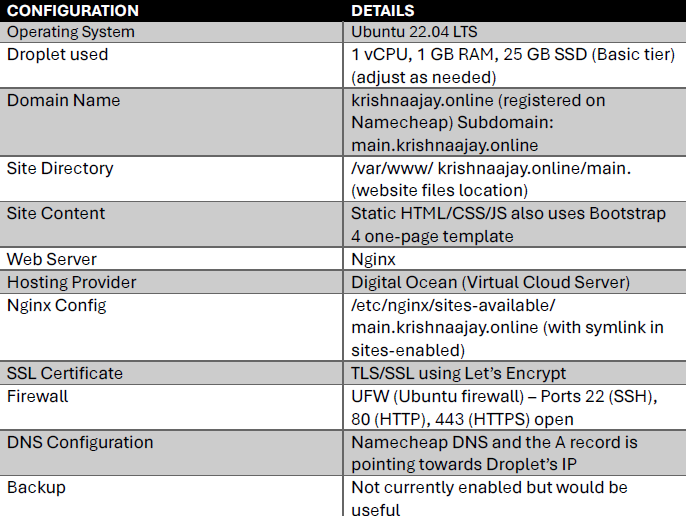

NAME: KRISHNA AJAY
STUDENT ID: 33694173
UNIVERSITY: MURDOCH UNIVERSITY
UNIT COORDINATOR: DAVID MURRAY 
ICT171 INTRODUCTION TO SERVER ENVIRONMENTS AND ARCHITECTURES (S1, 2025)

#**PORTFOLIO WEBSITE SERVER BUILD AND TROUBLESHOOTING GUIDE**

##**PURPOSE OF DOCUMENT:**

This document provides a step-by-step guide to rebuild my personal portfolio website and troubleshoot common issues. The website is a one-page static portfolio using the free bootstrap 4 template. The page also has some custom student information, manual JavaScript and CSS scripts. The java scripts were used to show real time to the users as they are in my portfolio website. The server runs on ubuntu 22.04 LTS Droplet using Digital Ocean with Nginx and Let’s Encrypt SSL. This document will help any IT professional to recreate my site or restore my site in approximately 2 hrs.  It will include instruction on deploying my site, configuring domain and SSL Lastly best practices using backup tips to resolve any issues that might come up.

## 📋 PERSONAL SITE CONFIGURATION TABLE

